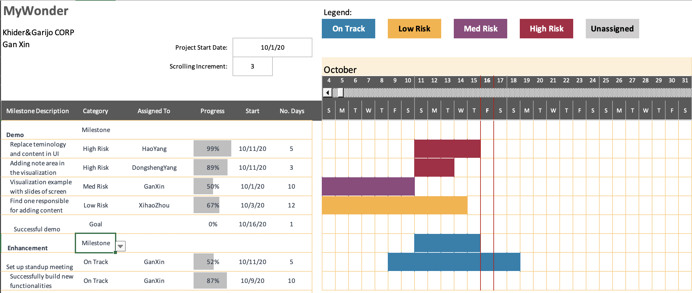

## Documentation of MyWonder

### Project Summary

**MyWonder** is a platform for big data analytic and visualization provided by _Khider&Garijo CORP_!
MyWonder features in reducing the time for visualization to under 10 minutes which used to take hours, an efficient way to distribute files on the cloud and the availability for users to calculate analytics and summaries from phone in a short time.

### Wastes
1. **Defect** No separating testing and production enviroment. Any changes in the testing phase would affect the product and need time to recover.
2. **Transport** In order to make changes, the demand need to be pass around start from the customer assistance team to designer and in the end to the backend developers, which is a waste of time in the process.
3. **Overprocessing** Each of the member is asked to create a few visualization examples and provide step to step screen shots. This can be done by one or two experts in visualization instead of the whole team.

### Deliverables
- **Replacement of terminology and contents in the user interface** The current ones are not appropariate for demo, need to change them in new release for demo.
- **Note area in the visualization** There is no area for a note in the visualization, need to add one.
- **Step to step visualization examples for the demo** Examples of visualization with powerpoint of step by step screen shots.

### Milestone
- **Hire or select a current team member who can quickly change contents before demo** Help the manager to prepare for the demo.
- **Standup meeting** Start standup meetings for the whole team to sync up the needs and demands.
- **Successful demo** 
- **Successful build of new functionalities** 

### Gantt chart

